# Automatic Brain Tumor Segmentation

Note: This project is not currently active. It is likely outdated and buggy. I unfortunately do not have the time to update it or keep up with pull requests. 

Brain tumor segmentation seeks to separate healthy tissue from tumorous regions such as the advancing tumor, necrotic core and surrounding edema. This is an essential step in diagnosis and treatment planning, both of which need to take place quickly in the case of a malignancy in order to maximize the likelihood of successful treatment. Due to the slow and tedious nature of manual segmentation, there is a high demand for computer algorithms that can do this quickly and accurately.

## Table of Contents
1. [Dataset](#dataset)
2. [MRI Background](#mri-background)
    * [MRI Pre-Processing](#mri-pre-processing)
    * [Pulse Sequences](#pulse-sequences)
    * [Segmentation](#segmentation)
3. [High Grade Gliomas](#high-grade-gliomas)
4. [Convolutional Neural Networks](#convolutional-neural-networks)
    * [Model Architecture](#model-architecture)
    * [Training the Model](#training-the-model)  
    * [Patch Selection](#patch-selection)
    * [Results](#results)
5. [Future Directions](#future-directions)

## Dataset

All MRI data was provided by the [2015 MICCAI BraTS Challenge](http://www.braintumorsegmentation.org), which consists of approximately 250 high-grade glioma cases and 50 low-grade cases. However, due to the limited time  Each dataset contains four different MRI [pulse sequences](#pulse-sequences), each of which is comprised of 155 brain slices, for a total of 620 images per patient. Professional segmentation is provided as ground truth labels for each case. Figure 1 is an example of a scan with the ground truth segmentation. The segmentation labels are represented as follows:  

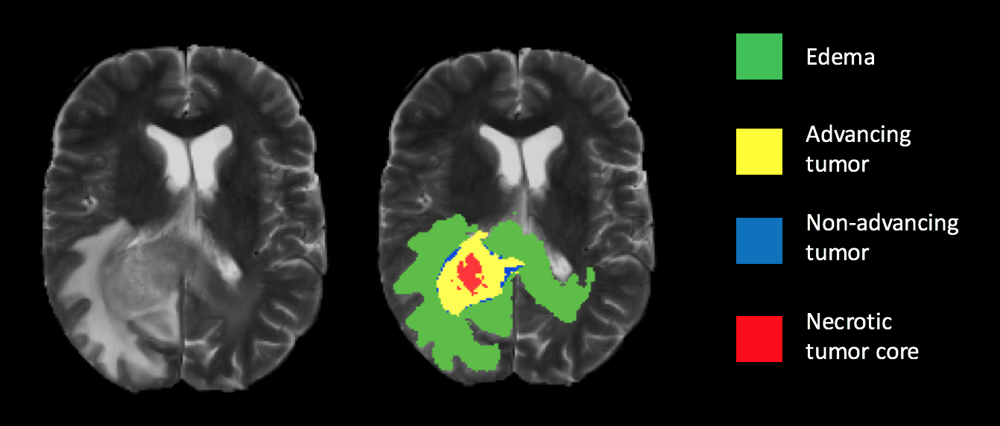  
<b>Figure 1: </b> Ground truth segmentation overlay on a T2 weighted scan.    

## MRI Background

Magnetic Resonance Imaging (MRI) is the most common diagnostic tool brain tumors due primarily to it's noninvasive nature and ability to image diverse tissue types and physiological processes. MRI uses a magnetic gradient and radio frequency pulses to take repetitive axial slices of the brain and construct a 3-dimensional representation(Figure 2). Each brain scan 155 slices, with each pixel representing a 1mm3 voxel.  

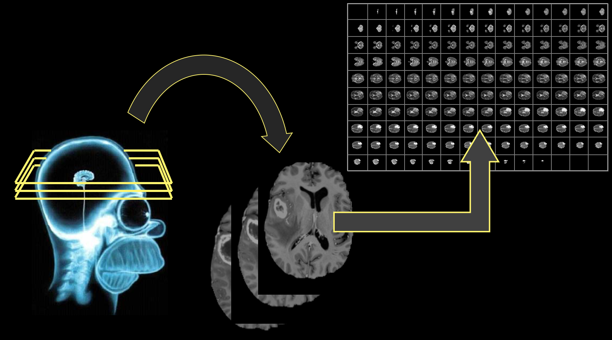
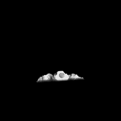  
 <b> Figure 2: </b> (Left) Basic MRI workflow. Slices are taken axially at 1mm increments, creating the 3-dimensional rendering (right). Note that this is only one of four commonly-used pulse sequences used for tumor segmentation. 

### MRI pre-processing ([code](https://github.com/naldeborgh7575/brain_segmentation/blob/master/code/brain_pipeline.py))

One of the challenges in working with MRI data is dealing with the artifacts produced either by inhomogeneity in the magnetic field or small movements made by the patient during scan time. Oftentimes a bias will be present across the resulting scans (Figure 3), which can effect the segmentation results particularly in the setting of computer-based models.

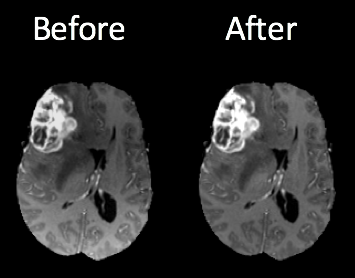  
<b>Figure 3:</b> Brain scans before and after n4ITK bias correction. Notice the higher intensity at the bottom of the image on the right. This can be a source of false positives in a computer segmentation.   

I employed an [n4ITK bias correction](http://www.ncbi.nlm.nih.gov/pubmed/20378467) on all T1 and T1C images in the dataset ([code](https://github.com/naldeborgh7575/brain_segmentation/blob/master/code/n4_bias_correction.py)), which removed the intensity gradient on each scan. Additional image pre-processing requires standardizing the pixel intensities, since MRI intensities are expressed in arbitrary units and may differ significantly between machines used and scan times.

### Pulse sequences
There are multiple radio frequency pulse sequences that can be used to illuminate different types of tissue. For adequate segmentation there are often four different unique sequences acquired: Fluid Attenuated Inversion Recovery (FLAIR), T1, T1-contrasted, and T2 (Figure 4). Each of these pulse sequences exploits the distinct chemical and physiological characteristics of various tissue types, resulting in contrast between the individual classes. Notice the variability in intensities among the four images in Figure 4, all of which are images of the same brain taken with different pulse sequences.

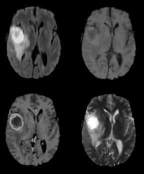  
<b> Figure 4: </b> Flair (top left), T1, T1C and T2 (bottom right) pulse sequences. 

### Segmentation
Notice now that a single patient will produce upwards of 600 images from a single MRI, given that all four sequences produce 155 slices each (Figure 5). To get a satisfactory manual segmentation a radiologist must spend several hours tediously determining which voxels belong to which class. In the setting of malignant brain tumors, an algorithmic alternative would give clinicians more time focusing on the wellbeing of the patient, allowing for more immediate patient care and higher throughput treatment times.

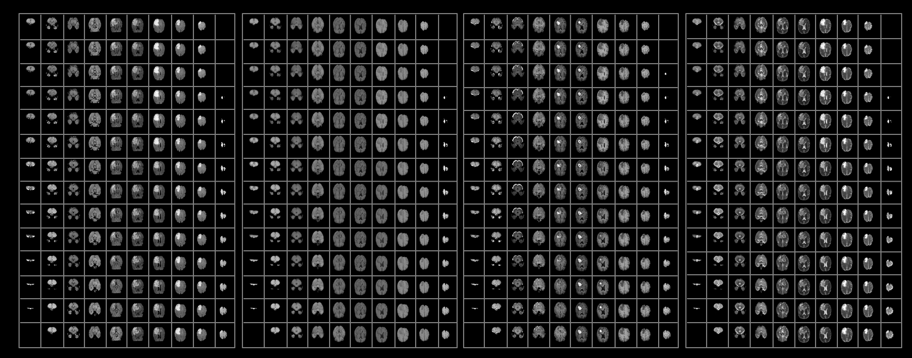  

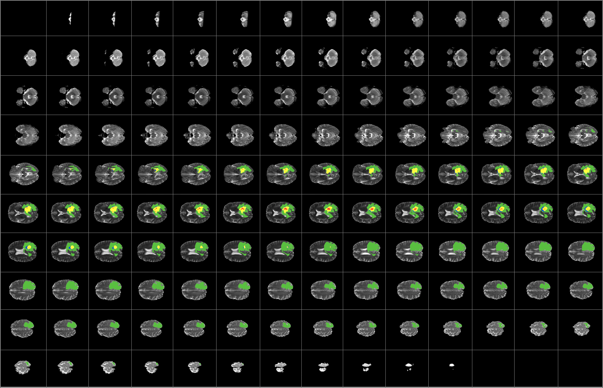  
 <b>Figure 5:</b> (Top) Representative scans from each tumor imaging sequence. Approximately 600 images need to be analyzed per brain for a segmentation. (Bottom) The results of a complete tumor segmentation.

Automatic tumor segmentation has the potential to decrease lag time between diagnostic tests and treatment by providing an efficient and standardized report of tumor location in a fraction of the time it would take a radiologist to do so.

## High Grade Gliomas

<b>Glioblastoma cases each year (US)</b>[5](#references): 12,000  
<b>Median survival</b>: 14.6 months  
<b>Five-year survival rate</b>: < 10%

High-grade malignant brain tumors are generally associated with a short life expectancy and limited treatment options. The aggressive nature of this illness necessitates efficient diagnosis and treatment planning to improve quality of and extend patient life. This urgency reinforces thee need for reliable and fast automatic segmentation methods in clinical settings. Unfortunately, algorithmic segmentation of these particular tumors has proven to be a very challenging task, due primarily to the fact that they tend to be very structurally and spatially diverse (Figure 6).

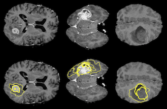  
<b>Figure 6: </b> Three different examples of high grade gliomas, tumor segmentations are outlined on the bottom images. Notice the variation in size, shape and location in the brain, a quality of these tumors that makes them difficult to segment. 

## Convolutional Neural Networks

Convolutional Neural Networks(CNNs) are a powerful tool in the field of image recognition. They were inspired in the late 1960s by the elucidation of how the [mammalian visual cortex works](https://en.wikipedia.org/wiki/Receptive_field): many networks neurons sensitive to a given 'receptive field' tiled over the entire visual field[2](#references). This aspect of CNNs contributes to their high flexibility and spatial invariance, making them ideal candidates for semantic segmentatiaon of images with high disparity in locations of objects of interest. CNNs are a powerful tool in machine learning that are well suited for the challenging problem tackled in this project.

### Model Architecture ([code](https://github.com/naldeborgh7575/brain_segmentation/blob/master/code/Segmentation_Models.py))

I use a four-layer Convolutional Neural Network (CNN) model that, besides [n4ITK](#mri-pre-processing) bias correction, requires minimal [pre-processing](https://github.com/naldeborgh7575/brain_segmentation/blob/master/brain_pipeline.py). The model can distinguish between and predict healthy tissue, actively enhancing tumor and non-advancing tumor regions (Figure 7).  The local invariant nature of CNNs allows for abstraction of token features for classification without relying on large-scale spatial information that is inconsistent in the case of tumor location.

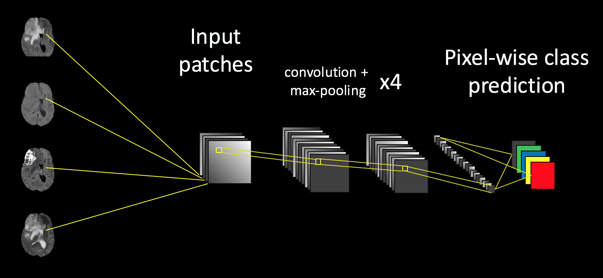  
<b>Figure 6: </b> Basic model architecture of my segmentation model. Input is four 33x33 patches from a randomly selected slice. Each imaging pulse sequence is input as a channel into the net, followed by four convolution/max pooling layers (note- the last convolutional layer is not followed by max pooling). 

### Training the Model

I created the model using Keras and ran it on an Amazon AWS GPU-optimized EC2 instance. I tested several models, but elected to use the 4-layer sequential model shown in Figure 6 due to the two-week time constraint of the project, as it had best initial results and fastest run time.

The model was trained on randomly selected 33x33 patches of MRI images to classify the center pixel. Each input has 4 channels, one for each imaging sequence, so the net can learn what relative pixel intensities are hallmarks of each given class. The model is trained on approximately 50,000 patches for six epochs. The model generally begins to overfit after six epochs, and the validation accuracy on balanced classes reaches approximately 55 percent. [Future directions](#future-directions) will include more training phases and updated methods for patch selection.

### Patch Selection ([code](https://github.com/naldeborgh7575/brain_segmentation/blob/master/code/patch_library.py))
The purpose of training the model on patches (Figure 8) is to exploit the fact that a class of any given voxel is highly dependent on the class of it's surrounding voxels. Patches give the net access to information about the pixel's local environment, which influences the final prediction of the patch.

  
<b> Figure 8: </b> Examples of 33 x 33 pixel patches used as input for the neural network. These particular patches were acquired with a T1C pulse sequence, but the actual input includes all pulse sequences. 

Another important factor in patch selection is to make sure the classes of the input data are balanced. Otherwise, the net will be overwhelmed with background images and fail to classify any of the minority classes. Approximately 98% of the data belongs to the background class (healthy tissue or the black surrounding area), with the remaining 2% of pixels divided among the four tumor classes.

I tried out several different methods for sampling patches, which had a large impact on the results. I began randomly selecting patches of a given class from the data and repeating this for all five classes. However, with this sampling method approximately half of the background patches were just the zero-intensity area with no brain, so the model classified most patches with brain tissue as tumor, and only the black areas as background (Figure 9).

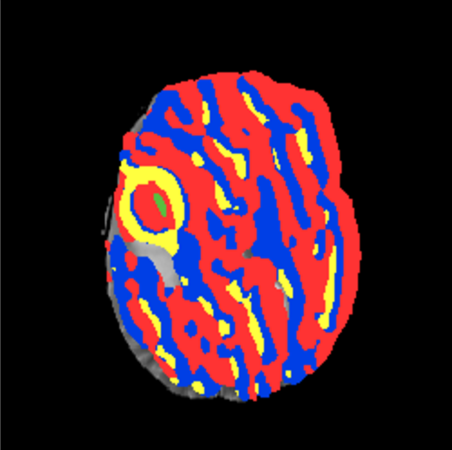
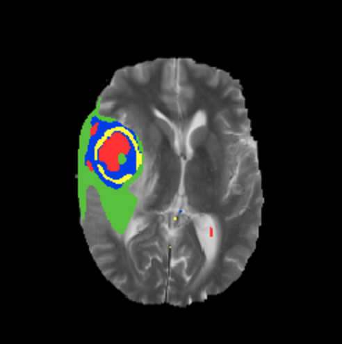  
<b> Figure 9: </b> (Left) results of segmentation without excluding exclusively zero-intensity patches. Notice that even healthy tissue is classified as tumor. (Right) results of segmentation after restricting the amount of zero-intensity pixels allowed in a given patch. The tumor prediction is now restricted mostly to the actual area of the lesion   

I then restricted the selection process to exclude patches in which more than 25% of the pixels were of zero-intensity. This greatly improved the results, one of which can be seen on the right in Figure 9.

Unfortunately the model still struggles with class boundary segmentation. The boundaries in my results are quite smooth, while the ground truth tends to have more detail. This is a downside to working with patch-based prediction, since the predicted identity of boundary pixels is influenced by neighbors of a different class. A method I've played to fix this involves selecting a certain subset of the training data from the highest entropy patches in the ground truth segmentation. High entropy patches have more classes represented in them, so the model will have more boundary examples to learn from. I am still fine tuning this process and will be updating the results accordingly.

### Results

Below is a summary of how well the current model is predicting. As more advances are made this section will be updated. A representative example of a tumor segmentation on test data is displayed in Figure 10. The model can identify each of the four classes with a good amount of accuracy, with the exception of class boundaries, which are smoother in my prediction than the ground truth.

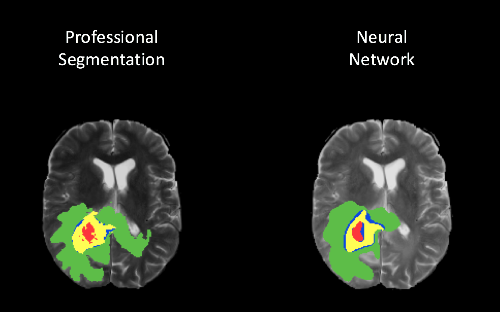  
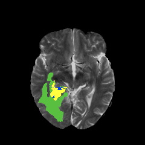
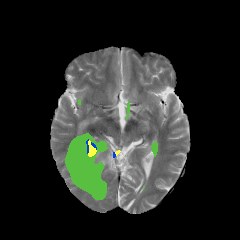  
<b> Figure 10: </b> Results of CNN model segmentation on a single slice (top) with respect to the ground truth, and a 3D representation of the segmentation (bottom). 

Notice that towards the top of the 3-dimensional network results representation some of the cerebrospinal fluid (CSF) is incorrectly classified as tumor. This is unsurprising, considering that the CSF has similar features to parts of the tumor in some pulse sequences. There are several potential solutions for this:

1. Pre-process the images by masking CSF (much easier than tumors to extract)
2. Train the model on more CSF-containing patches so it can learn to distinguish between CSF and tumor
3. Add more nodes to the model, which may cause it to learn more features from the current patches.

## Future Directions

While my model yields promising results, an application such as this leaves no room for errors or false positives. In a surgical setting it is essential to remove as much of the tumor mass as possible without damaging any surrounding healthy tissue. There are countless ways to improve this model, ranging from the overall architecture, to adjusting how we sample the data.

When I began building the model I built an architecture based on one built by [Havaei et al](http://arxiv.org/pdf/1505.03540.pdf), which uses a cascaded, two-pathway architecture and looks at both local and global features of patches. I elected to use the simpler model to meet the two-week deadline for this project, but in the future I will work on tuning models similar to this to improve upon the accuracy of this model.

## References

    1. Havaei, M. et. al, Brain Tumor Segmentation with Deep Neural Networks. arXiv preprint arXiv:1505.03540, 2015.
    2. Hubel, D. and Wiesel, T. Receptive fields and functional architecture of monkey striate cortex. Journal of Physiology 1968.
    3. Kistler et. al, The virtual skeleton database: an open access repository for biomedical research and collaboration. JMIR, 2013.
    4. Menze et al., The Multimodal Brain Tumor Image Segmentation Benchmark (BRATS), IEEE Trans. Med. Imaging, 2015.
    5. Stupp et al., Effects of radiotherapy with concomitant and adjuvant temozolomide versus radiotherapy alone on survival in glioblastoma in a randomised phase III study: 5-year analysis of the EORTC-NCIC trial. The Lancet Onc., 2009.
    6. Tustison, NJ. et. al, N4ITK: improved N3 bias correction. IEEE Trans Med Imaging, 2010.
