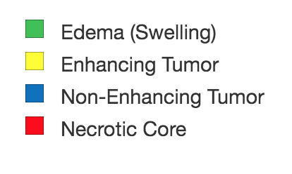

# Automatic Brain Tumor Segmentation

Brain tumor segmentation seeks to separate healthy tissue from tumorous regions such as the advancing tumor, necrotic core and surrounding edema. This is an essential step in diagnosis and treatment planning, both of which need to take place quickly in the case of a malignancy in order to maximize the likelihood of successful treatment. Due to the slow and tedious nature of manual segmentation, there is a high demand for computer algorithms that can do this quickly and accurately.

## Table of Contents
1. [Dataset](#dataset)
2. [MRI Background](#mri-background)
    * [Pulse Sequences](#pulse-sequences)
    * [Segmentation](#segmentation)
3. [High Grade Gliomas](#high-grade-gliomas)
4. [Convolutional Neural Networks](#convolutional-neural-networks)
    * [Implementation](#implementation)
5. [Results](#results)

## Dataset

All MRI data was provided by the [2015 MICCAI BraTS Challenge](http://www.braintumorsegmentation.org), which consists of approximately 300 high-grade glioma cases. Each dataset contains four different MRI [pulse sequences](http://radiopaedia.org/articles/mri-sequences-overview), each of which is comprised of 155 brain slices, for a total of 620 images per patient. Professional segmentation is provided as ground truth labels for each case. Figure 1 is an example of a scan with the ground truth segmentation. The segmentation labels are represented as follows:

  
<b>Figure 1: </b> Ground truth segmentation overlay on a T2 weighted scan.    

## MRI Background

Magnetic Resonance Imaging (MRI) is the most common diagnostic tool brain tumors due primarily to it's noninvasive nature and ability to image diverse tissue types and physiological processes. MRI uses a magnetic gradient and radio frequency pulses to take repetitive axial slices of the brain and construct a 3-dimensional representation(Figure 2). Each brain scan 155 slices, with each pixel representing a 1mm3 'voxel.'  

  
 <b> Figure 2: </b> (Left) Basic MRI workflow. Slices are taken axially at 1mm increments, creating the 3-dimensional rendering (right). Note that this is only one of four commonly-used pulse sequences used for tumor segmentation. 

### Pulse sequences
There are multiple radio frequency pulse sequences that can be used to illuminate different classes of tissues. For adequate segmentation there are often four different scans acquired: Fluid Attenuated Inversion Recovery (FLAIR), T1, T1-contrasted, and T2 (Figure 3). Each of these pulse sequences utilizes the chemical and physiological characteristics of the various tumor classes, resulting in contrast between areas with distinct compositions. Notice the variability in intensities among the four images in Figure 3, all of which are images of the same slice of the same brain taken with different pulse sequences.

  
<b> Figure 3: </b> Flair (top left), T1, T1C and T2 (bottom right) pulse sequences. 

### Segmentation
Notice now that a single patient will produce upwards of 600 images from a single MRI, given that all four sequences produce 155 slices each (Figure 4). To get an acceptably accurate manual segmentation a radiologist must spend a number of hours tediously determining which voxels belong to which class. In the setting of malignant brain tumors, an algorithmic alternative would give clinicians more time focusing on the wellbeing of the patient, allowing for more immediate patient care and higher throughput treatment times.

  

  
 <b>Figure 4:</b> (Top) Representative scans from each tumor imaging sequence. Approximately 600 images need to be analyzed per brain for a segmentation. (Bottom) The results of a complete tumor segmentation.

Automatic tumor segmentation has the potential to decrease lag time between diagnostic tests and treatment by providing an efficient and standardized report of tumor location in a fraction of the time it would take a radiologist to do so.

## High Grade Gliomas

High-grade malignant brain tumors are generally associated with a short life expectancy and limited treatment options. The aggressive nature of this illness necessitates efficient diagnosis and treatment planning to improve quality of and extend patient life.

There is therefore a need for reliable and automatic segmentation methods in clinical settings. However, brain tumors are structurally and spatially diverse by nature, which makes this a challenging problem that has yet to be adequately conquered.

## Convolutional Neural Networks

### Implementation

I use a four-layer Convolutional Neural Network (CNN) model that that requires minimal pre-processing and can distinguish healthy tissue, actively enhancing tumor and non-advancing tumor regions.  The local invariant nature of CNNs allows for abstraction of token features for classification without relying on large-scale spatial information that is not consistent in tumor location.

The model is trained on randomly selected 33x33 patches of MRI images in order to classify the center pixel. Each input has 4 channels, one for each imaging pulse sequence (T1, T1c, T2 and Flair).

### Results

### References

    Menze et al., The Multimodal Brain Tumor Image Segmentation Benchmark (BRATS), IEEE Trans. Med. Imaging, 2015.
    Kistler et. al, The virtual skeleton database: an open access repository for biomedical research and collaboration. JMIR, 2013.
